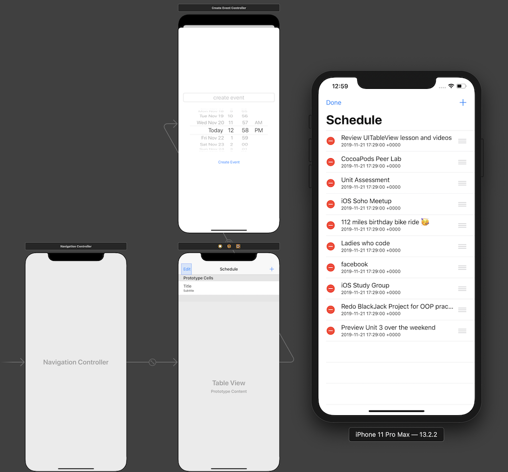
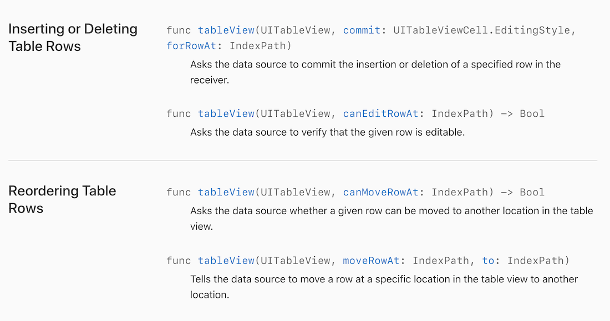

# Scheduler

Using FileManager and documents directory to save user created data. 

#### Screenshot of Main UI

## Key [UITableViewDataSource](https://developer.apple.com/documentation/uikit/uitableviewdatasource) methods for editing table view rows

